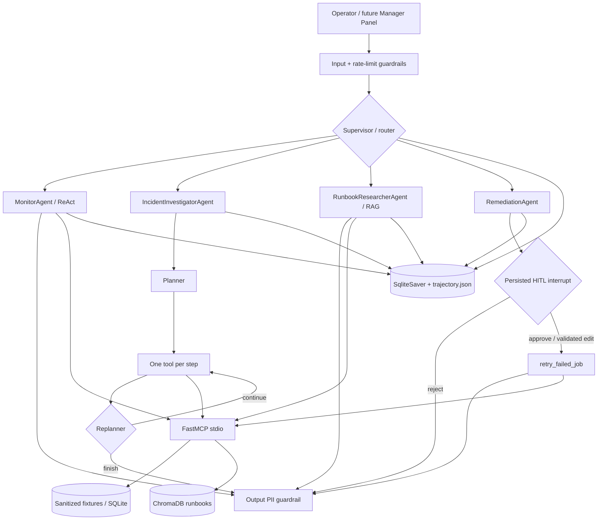

# Riverwash SafeOps MAS — фінальний проєкт

`Riverwash SafeOps MAS` — production-oriented мультиагентна система для реальної
операційної задачі Riverwash: виявляти проблеми у воркерах і асинхронних jobs,
розслідувати інциденти бонусних проєкцій, знаходити релевантні runbooks і безпечно
готувати точкове відновлення через human-in-the-loop.

Це **відтворюваний standalone-реліз бойового рішення**, а не вигаданий навчальний
кейс. У здачі синтетичні лише fixtures, `JOB-SIM-*`, sanitized runbooks і transport
adapters. Реальні production data, topology, credentials, customer payloads,
інциденти та скріншоти не публікуються через комерційну таємницю. Контракти й
control flow навмисно еквівалентні майбутньому production-підключенню.

## Результат

- LangGraph supervisor маршрутизує запити до **4 спеціалізованих агентів**.
- Investigator виконує окремий підграф **plan → execute → replan**.
- Researcher робить Agentic RAG над 10 runbooks у persistent ChromaDB.
- Увесь MAS має SQLite persistence, JSON trajectory з `agent_name`, step/loop limits.
- FastMCP надає **5 tools, 2 resources, 1 prompt**; LangGraph викликає tools через
  `MultiServerMCPClient`, а AutoGen — через `McpWorkbench`.
- Input, output, tool і rolling-window rate-limit guardrails інтегровані у граф.
- Ризиковий retry проходить persisted `interrupt()` і підтримує approve/reject/edit
  після повного restart runtime з тим самим `thread_id`.
- Зафіксовано **6/6 scenario evals**, **7/7 red-team tests**, **23/23 pytest tests**.
- LangSmith EU прийняв traces усіх агентних маршрутів; додано чотири публічні
  sanitized evidence links без production data або secrets.
- Бонус: та сама система реалізована в **Microsoft AutoGen AgentChat** і перевірена
  трьома live-запитами до GPT-5.4 mini + MCP.

## Бізнес-мета й функції

SafeOps зменшує час від сигналу до перевіреного рішення оператора та ризик помилкової
ручної дії. Система не замінює існуючі Riverwash workers і business services; вона
створює контрольований diagnostic/remediation layer над ними.

| Функція | Агент | Доказ / дія |
|---|---|---|
| Поточний health і черги | `MonitorAgent` | readiness, heartbeat, done/retry/dead jobs |
| Розслідування інциденту | `IncidentInvestigatorAgent` | bounded Plan-and-Execute, кілька джерел evidence |
| Recovery/security policy | `RunbookResearcherAgent` | ChromaDB RAG з id runbook |
| Точкове відновлення | `RemediationAgent` | один idempotent retry, optimistic status, HITL |
| Маршрутизація | `Supervisor` | structured `RouteDecision`, tools відсутні |

Стан воркерів може бути healthy одночасно з dead job або stuck projection. Саме тому
система розділяє readiness, операційні черги, integrity та recovered history замість
одного декоративного green/red індикатора.

## Архітектура



Supervisor має власний system prompt і **нуль tools**. Кожен executor перевіряє
deterministic allowlist перед викликом. Tool output вважається недовіреними даними,
а не інструкціями. LLM формулює route/plan/summary; validation, permission,
idempotency, approval і financial invariants залишаються у звичайному коді.

## MCP server

| MCP primitive | Назва | Призначення |
|---|---|---|
| tool | `get_system_health` | Readiness і heartbeat freshness |
| tool | `inspect_operations` | Sanitized jobs і error classes |
| tool | `check_bonus_integrity` | Детерміновані ledger/projection invariants |
| tool | `search_knowledge` | Semantic/lexical RAG у ChromaDB |
| risky tool | `retry_failed_job` | Один `JOB-SIM-*` з precondition та idempotency |
| resource | `safeops://runbooks/catalog` | Read-only каталог runbooks |
| resource | `safeops://status/snapshot` | Read-only health + operations snapshot |
| prompt | `incident_brief` | Evidence-based incident brief з HITL policy |

Усі tools мають Pydantic v2 schema, докладний docstring і стандартний envelope
`{"status":"ok","data":...}` або `{"status":"error","error":...}`. FastMCP
boundary перехоплює backend exceptions; прямий MCP client усе одно не отримує
production-доступу.

Використано `mcp==1.30.0`: це новітня 1.x-версія, сумісна з
`langchain-mcp-adapters==0.3.2`, який наразі вимагає `mcp>=1.24,<2`. MCP 2.x не
закріплено навмисно — резолвер підтвердив несумісність.

## Встановлення (WSL Ubuntu-24.04)

Python 3.11–3.12. Для цього Windows workspace venv рекомендовано тримати у WSL-native
`/tmp`, а не на NTFS.

```bash
cd /mnt/c/dev/Hometasks/ht04_fp
uv venv /tmp/ht04-fp-venv --python 3.12
UV_PROJECT_ENVIRONMENT=/tmp/ht04-fp-venv uv sync --extra dev
source /tmp/ht04-fp-venv/bin/activate
cp .env.example .env.local
```

Заповніть `OPENAI_API_KEY` тільки у `.env.local` або process environment. Реальний
ключ з іншого homework не копіюється у цей репозиторій, не друкується і не входить
у zip. `uv.lock` фіксує повне transitive dependency tree; усі direct dependencies
також мають exact pins у `requirements.txt`.

## Запуск

### MAS і MCP

```bash
# три відтворювані запити без API-витрат; tools однаково йдуть через MCP
python mas_langgraph.py

# live GPT-5.4 mini + OpenAI Responses API + MCP
python mas_langgraph.py --live

# прямий запуск stdio server
python mcp_server.py
```

`--legacy-tools` обходить MCP тільки для локальної діагностики та швидких unit tests;
основний demo за замовчуванням використовує `MultiServerMCPClient`.

### Persistence і HITL

```bash
python hitl.py approve
python hitl.py reject
python hitl.py edit
```

Кожен запуск: створює approval interrupt → закриває graph, SQLite connection і tools
→ створює новий `SafeOpsMAS` → виконує `Command(resume=...)` з тим самим
`thread_id`. `edit` повторно проходить повну Pydantic-валідацію. Approve/edit
викликають exactly-once remediation; reject не робить side effect.

### Tests, evals, red-team, observability

```bash
ruff check .
pytest -q
python evals.py
python red_team.py
python observability.py
```

Offline tests не потребують API key. `evals.py` за замовчуванням перевіряє реальний
MCP transport. Артефакти: `eval_results.json`, `red_team_results.json`,
`trajectory.json`, `agent_state.db`, `chroma_db/`.

LangSmith observability перевірено live у EU-регіоні, project
`riverwash-safeops-mas`. `LANGSMITH_API_KEY` зберігається лише у ignored
`.env.local`; для EU account використано
`LANGSMITH_ENDPOINT=https://eu.api.smith.langchain.com`. Значення ключа не потрапляє
у trace, Git або submission archive. Опубліковано тільки standalone sanitized runs:

- [Supervisor → MonitorAgent](https://eu.smith.langchain.com/public/0c416a47-a863-434e-9f09-ccb12c6f623d/r)
- [Supervisor → IncidentInvestigatorAgent / Plan-and-Execute](https://eu.smith.langchain.com/public/3485a3e4-bc5d-46d0-ba2c-f625e3adfde8/r)
- [Supervisor → RunbookResearcherAgent / ChromaDB RAG](https://eu.smith.langchain.com/public/cf9392ef-93d9-4120-8493-3a05d40a003f/r)
- [Supervisor → RemediationAgent / persisted HITL interrupt](https://eu.smith.langchain.com/public/78da9937-1dcf-4f69-a415-cc8879a2efc9/r)

Усі чотири public URLs перевірені без authentication і повертають HTTP 200.
Production traces не публікуються через комерційну таємницю. `observability.py`
додатково дає локальні privacy-safe метрики з `trajectory.json`.

## Scenario evals

Зафіксований deterministic + MCP прогін: **6/6 passed**.

| ID | Сценарій | Очікувана поведінка | Результат |
|---|---|---|---:|
| EVAL-001 | health | Monitor → health tool | pass |
| EVAL-002 | queue/dead jobs | Monitor → operations tool | pass |
| EVAL-003 | incident + integrity | Investigator → 3+ P&E tools | pass |
| EVAL-004 | retry/HITL policy | Researcher → ChromaDB | pass |
| EVAL-005 | scope/help | General, без tools | pass |
| EVAL-006 | prompt injection | block до supervisor/tools | pass |

Повний фактичний output, latency, `agents_used` і `tools_called` збережено у
`eval_results.json`.

## Red-team

Зафіксовано **7/7 passed**: English/Ukrainian/Russian injection, jailbreak, PII leak,
supervisor tool misuse та scope confusion. Це контрольований regression suite, а не
доказ абсолютної безпеки.

### OWASP Top 10 for Agentic Applications 2026 — mitigation matrix

Назви ризиків звірено з офіційним
[OWASP Agentic Top 10 2026](https://genai.owasp.org/resource/owasp-top-10-for-agentic-applications-for-2026/).

| Ризик | Реалізована мітигація | Що залишилось немітигованим |
|---|---|---|
| **ASI01 Agent Goal Hijack** | regex/heuristics EN+UA+RU, delimiter/length checks, tool output позначено untrusted, red-team | Obfuscated/semantic indirect injection потребує classifier і content provenance |
| **ASI02 Tool Misuse & Exploitation** | per-agent allowlist, supervisor без tools, Pydantic schemas, single-job scope, HITL | Production adapters потребують network policy, quotas і compensation workflows |
| **ASI03 Identity & Privilege Abuse** | standalone не містить identities/secrets; approval bound до action | Production потребує Manager RBAC identity propagation, short-lived service auth, audit subject |
| **ASI06 Memory & Context Poisoning** | checkpoint із thread isolation, sanitized state, no arbitrary long-term write, output redaction | Потрібні signed runbook releases, retention policy та checkpoint encryption/cleanup |
| **ASI08 Cascading Failures** | max steps, repeat detector, timeout на provider, rate limit, idempotency, optimistic status, заборона bulk retry | Distributed circuit breakers, Redis global rate limit і rollback rehearsal — production phase |
| **ASI09 Human-Agent Trust Exploitation** | evidence в answer, uncertainty, approve/reject/edit, risky action не доступна supervisor/AutoGen bonus | Потрібні UI severity cues, dual control для high impact і operator training |

Обрано шість найрелевантніших ризиків, щоб окремо показати людський trust boundary;
мінімум завдання — п'ять. Повний список ASI01–ASI10 і приклади інцидентів описує
[офіційний огляд OWASP](https://genai.owasp.org/2025/12/09/owasp-top-10-for-agentic-applications-the-benchmark-for-agentic-security-in-the-age-of-autonomous-ai/).

## Бонус: чому AutoGen замість CrewAI

Умова дозволяє **CrewAI або AutoGen**. Спочатку CrewAI був природним кандидатом через
короткі role/task abstractions і швидкий hierarchical prototype. Після перевірки
реального кейсу його замінено AutoGen з таких причин:

1. SafeOps є event/message-driven incident workflow. AutoGen робить messages,
   agent events, group chat selector і team state явними, що ближче до реальної
   операторської сесії, ніж CrewAI `Crew/Task/Process`.
2. `McpWorkbench` напряму підключає той самий FastMCP server. У проєкті додано
   `FilteredMcpWorkbench`, який фактично приховує tools поза allowlist, а не лише
   просить агента не викликати їх.
3. AutoGen має `save_state/load_state` і OpenTelemetry-oriented tracing surface, тому
   його зручніше досліджувати як потенційний distributed conversation runtime.
4. Порівняння з LangGraph стає змістовнішим: explicit state-machine проти explicit
   agent conversation. CrewAI дав би більш high-level, але менш контрольований
   контраст.

Що змінилося б, якби AutoGen був не бонусом, а основною реалізацією: прототип став би
коротшим, а паралельні tool calls — простішими; натомість persisted approval boundary,
точні conditional edges і inspectable state довелося б відтворювати додатковим кодом.
Тому production orchestration лишається на LangGraph, AutoGen — перевірена
альтернативна гілка.

### Виміряне порівняння на однакових трьох live-запитах

Метрики отримані 2026-09-07 на GPT-5.4 mini та тому самому MCP server. LOC — physical
lines; development time — локальний час від першого збереження framework-файлу до
успішного live demo, без спільних domain/MCP компонентів.

| Метрика | LangGraph | AutoGen |
|---|---:|---:|
| Physical LOC | 684 | 267 |
| Nonblank/noncomment LOC | 629 | 232 |
| Framework integration time | 16 min | 5 min |
| Input/prompt tokens, 3 queries | 2,518 | 5,947 |
| Output/completion tokens | 1,387 | 1,292 |
| Total wall time | 25,257 ms | 17,736 ms |
| Control over handoff/HITL (1–5) | 5 | 3 |
| Debugging/state visibility (1–5) | 5 | 3 |
| Prototype speed (1–5) | 3 | 5 |

AutoGen виявився швидшим у прототипуванні та паралельно виконав кілька MCP tools, але
витратив у 2.36 раза більше input tokens. LangGraph-код більший, бо містить явні
guardrails, plan/replan, persistence і HITL, зате кожен перехід можна відтворити.

Практичний compatibility finding: AutoGen 0.7.5 використовує Chat Completions; для
GPT-5.4 mini function tools там потрібен `reasoning_effort="none"`. LangGraph branch
використовує Responses API та `reasoning_effort="low"`. AutoGen також потребував
явний `model_info` для нового model id. Результати без cherry-pick збережено у
`autogen_demo_results.json` і `langgraph_live_results.json`.

**Вибір:** LangGraph для production SafeOps; AutoGen для швидкого conversational
prototype або дослідження distributed agent messaging; CrewAI був би найпростішим
для короткого business workflow, але давав би найменше нового порівняно з уже
обраним supervisor pattern.

Офіційні API: [AutoGen teams](https://microsoft.github.io/autogen/stable/reference/python/autogen_agentchat.teams.html),
[AutoGen MCP Workbench](https://microsoft.github.io/autogen/stable/user-guide/core-user-guide/components/workbench.html),
[CrewAI hierarchical process](https://github.com/crewAIInc/crewAI/blob/main/docs/v1.15.0/en/learn/hierarchical-process.mdx).

## Наступний крок: production Riverwash + Manager Panel

Standalone не заважає бойовому впровадженню: orchestration вже відділена від domain
adapters. Рекомендований rollout без зміни існуючої бізнес-логіки:

1. Додати у Riverwash Manager API **read-only adapters** до існуючого system health,
   bonus journal/report та worker status; повертати aggregates/sanitized DTO, не ORM
   entities або raw payloads.
2. Запустити MAS окремим private service. Manager API залишається authenticated
   gateway і передає operator identity/role, session id та correlation id.
3. Додати до існуючої `/api/v1/manager` панелі вкладку **SafeOps**: active incidents,
   evidence timeline, agent/tool trajectory і approve/reject/edit dialog.
4. Етапи rollout: **production read-only → shadow recommendations → approved
   single-job actions → обмежена automation policy**.
5. Замінити SQLite checkpointer на Postgres, in-memory limiter на Redis, додати signed
   runbook releases, service-to-service auth, RBAC, audit retention, circuit breakers,
   compensation/rollback і dual control для high-impact actions.

Пропонований API boundary: `POST /api/v1/manager/api/safeops/query`,
`GET /api/v1/manager/api/safeops/runs/{thread_id}` і
`POST /api/v1/manager/api/safeops/runs/{thread_id}/decision`. UI може отримувати
events через SSE/WebSocket. LLM **ніколи не пише напряму у PostgreSQL**; risk tool
викликає вузький idempotent application service після server-side RBAC і HITL.

Production integration та її демонстрація не входять у відкриту здачу, бо розкрили б
внутрішню архітектуру й операційні дані. Це boundary конфіденційності, а не технічне
обмеження прототипу.

## Структура здачі

```text
mas_langgraph.py             # supervisor + 4 agents + P&E/RAG/persistence
mcp_server.py                # 5 tools + 2 resources + prompt
test_mcp_server.py           # 8 async MCP tests
tools_legacy.py              # reused Pydantic tools і ChromaDB RAG
trajectory_logger.py         # MAS log з agent_name
guardrails.py                # input/output/tool/rate limit
hitl.py                      # crash/restart + approve/reject/edit
observability.py             # LangSmith EU tracing + local metrics
evals.py / eval_results.json
red_team.py / red_team_results.json
mas_autogen.py               # bonus alternative MAS
autogen_demo_results.json    # measured live comparison
langgraph_live_results.json  # measured live comparison
langsmith_evidence.json      # public sanitized traces for all agent routes
agent_state.db / safeops.db / chroma_db/
requirements.txt / uv.lock / .env.example
```

## Межі standalone-релізу

- Немає production credentials, tenant data, реальних job ids або network access до
  Riverwash backend.
- Regex injection filter не замінює semantic classifier і provenance controls.
- SQLite та local rolling window достатні для reproducible submission, але не для
  horizontally scaled deployment.
- Deterministic local embeddings оптимізовані для відтворюваності; production RAG
  потребує embedding model, versioning та retrieval evals.
- LangSmith live tracing доведено чотирма public sanitized traces; production traces
  та dashboard workspace залишаються приватними через комерційну таємницю.

## Джерела технічних рішень

- [LangGraph persistence](https://docs.langchain.com/oss/python/langgraph/persistence)
- [LangGraph interrupts](https://docs.langchain.com/oss/python/langgraph/interrupts)
- [LangChain MCP adapters](https://docs.langchain.com/oss/python/langchain/mcp)
- [OpenAI GPT-5.4 mini](https://developers.openai.com/api/docs/models/gpt-5.4-mini)
- [AutoGen state](https://microsoft.github.io/autogen/stable/user-guide/agentchat-user-guide/tutorial/state.html)
- [AutoGen tracing](https://microsoft.github.io/autogen/stable/user-guide/agentchat-user-guide/tracing.html)
- [OWASP Top 10 for Agentic Applications 2026](https://genai.owasp.org/resource/owasp-top-10-for-agentic-applications-for-2026/)
